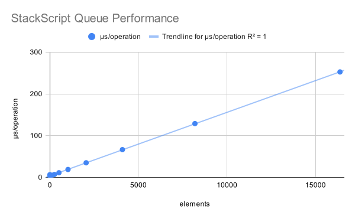
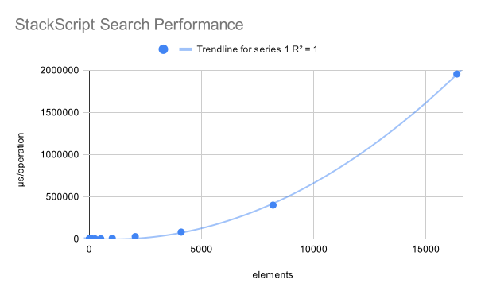

# **Project Report**

## **Problem Statement**
Problem: How can we create a beginner-friendly programming language in a creative way?

We will create a programming language interpreter that follows the stack oriented paradigm. Stack oriented programming languages work by manipulating data on a stack. The simplicity of hte operations makes them a good choice for developing programming languages.

## **Usage**
The primary program is the `stackscript` executable present in the build folder. It must be run with an argument containing the name of the specified program WITHOUT the txt extension. There are also two flags present for debug mode, `-d` and `-da` for debug mode in standard or verbose mode. Programs can be added in the `/src/programs/` directory with the .txt extension.

`$ ./build/stackscript sort -d`

## **Interpreter Structure**
The interpreter follows the standard process. It begins with lexical analysis where the source text file is converted into tokens. The second stage is syntactic analysis where the tokens are converted into meaningful statements. Due to the linear nature of StackScript, all abstract syntax trees are just lists making parsing much easier. Finally, the interpreter simply runs through the statements and executes them.

## **Related Data Structure Alternatives**

### Stacks (Chosen Data Structure)
The programming language is a stack-based language because the syntax becomes simple. For example, to evaluate `1+2`, the syntax for this language would become:

`1 2 + println`

To evaluate this, the stack would first add `1` and `2` to the stack. The stack now holds the values `[1,2]`, where the last element is the top of the stack. When the `+` arrives, the `2` and `1` will be popped from the stack and added. Then, the resulting value, `3`, will be added to the stack. When the println comes, the `3` will be popped from the stack and then printed.

### Dynamic Arrays
The stack is being implemented through dynamic arrays. One benefit of using dynamic arrays to implement stacks is that it is efficient to add elements at the end of the array and pop them off from the end of the array.

Although dynamic arrays are used to implement the stack, they were not used in their raw form. This is because it is much easier and understandable to use `peek()`, `pop()`, and `push()` methods than consistently accessing the last element in the array. Moreover, having the stack automatically resize itself when using the `push()` method makes programming much easier for the programmer. The abstraction of a stack class makes the program readable and avoids the need of implementing the functions every time.

### Queues
Queues are similar to stacks in that they use `peek()`, `pop()`, and `push()` methods to access, delete, and add only either the first or last element in the queue. However, the "First In First Out" property of a queue makes it less appealing than a stack, which has a "Last In First Out" property. One reason for this is that order of operation controllers are much better implemented with stacks. For example, the syntax `(2 3 4 + * PRINT)` can be evaluated like this:

1. Stack: `[2, 3, 4]`
2. To add, pop off `4` and `3` and add them, resulting in `7`.
3. Add `7` to the stack: `[2,7]`
4. Pop off `7` and `2` and multiply them, resulting in `14`.
5. Add `14` to the stack: `[14]`
6. Print `14`.

### Hash Table (Chosen for Function Lookup)
Hash tables used to store variable pointers. This is because accessing pointers to variables via a hash function is very efficient time-wise.

Another possible way to store the variables is through a dynamic array. The benefit of storing variables in the next available spot in an array is that arrays use much less space than hash tables. However, the biggest downside to an array is that iterating through an array to access a variable is much less efficient than using a hash function to access a variable in a hash table.

## **Operation Algorithms and Complexity**

### Hash Table

#### Hash Function (with Quadratic Probing)
The hash function involves hashing keys to buckets using the modulo operation. The best case scenario is when there is no collision after applying the hashing function to the key. In this case, the time complexity is O(1) because the time complexity of applying the hashing function is O(1).

The worst case scenario is when after applying the hash funciton to the key, a collision happens. The chosen method for handling collisions is quadratic probing. In this case, the time complexity is O(n) because it is theoretically possible for only one bucket to be available in the hash table, and for the program to traverse through all the buckets before reaching that empty bucket.

Specifically, our table uses an initial bucket size of 23 and a load factor of 0.5. It calculates the next size by doubling the current size and finding the next closest prime. For collision resolution it uses quadratic probing with the equation `(hash_index + num_collisions^2) % capacity`.

### Stack
The dynamic array implementation of the stack makes the stack functions very efficient.

#### Push
Because the stack is implemented with a dynamic array, pushing an element onto the stack is the same as appending to the end of the array. Appending to the end of the array involves only one operation because we have access to the size of the array. Therefore, the time complexity for pushing an element onto the stack is O(1).

If the stack is full, pushing an element to the stack requires the stack, implemented by a dynamic array, to be resized. Because this requires only one operation, the time complexity for pushing an element to the stack is still O(1).

#### Peek
Because we can access the top of the stack (end of the dynamic array) with one operation, the time complexity for peeking is O(1).

#### Pop
We have direct access to the top of the stack because we have direct access to the size of the array. Because the top of the stack is at the end of the dynamic array, deleting the top of the stack will not require any shifting of elements. Therefore, the time complexity for popping is O(1).

## **Testing Strategy**

### Data Structures
All code is empirically tested by performing operations on the target and observing how the computation time increases as the data size increases. For the stacks and hash tables a certain amount of elements are added, then a certain amount of operations are performed and the time per operation is calculated as time/operations. The code also tests that the data structure has expected results. For the stack, it makes sure the values at every location match when they were added. For the hash table, it makes sure that keys return the correct value.

### StackScript
The StackScript code is also tested for time complexity and matches the expected complexity. The testing for the StackScript programs is similar and performs operations on stacks of varying sizes. Due to the interactive nature of the programs, the tests only check the amount of time per operation, not whether or not the structure acts as expected. The StackScript programs were instead tested by hand.

## **When Does the Chosen Data Structure Fail?**

The syntax of StackScript is inherently based off the stack data structure. As a result, the syntax of StackScript can be awkward to use from a user standpoint. For example, in a programming language like Python, the syntax to print `(2 + 4) * 5` is as follows:

`print((2 + 4) * 5)`

This syntax is very straightforward because it reads how you would read a math expression. For example, the parentheses govern which operation is executed first. However, the stack-based syntax of StackScript makes it much harder to read. The same code above in python would look like this in StackScript:

`2 4 + 5 * println`

While this is readable so far, the expression can get complicated very fast when more functions are added. Although user defined functions can be made to increase readability and modularity, this can become tedious.

On the flip side, the stack-oriented syntax makes nesting operations very easy. Rather than needing a vast number of parentheses to control order of operations, the user can type just numbers and operations on a single line and control exactly what operations they want to compute at what time.

For example, in Python, the interpreter uses the order of operations as a guide for what to compute first. For example, addition comes after multiplication, and everything comes after parentheses. Because the top of the stack determines what operations happen first in StackScript, there is no confusion in what happens in what order.

## **Limitations and future work**

So far, StackScript has many essential programming features present in the most used programming languages. For example, it supports functions, loops, and conditionals. Additionally, it has the ability to accept input and print out statements.

One feature we have not implemented yet is Object Oriented Programming. This is an extremely important feature because it allows the user to create custom classes, objects, and even other data structures that are not inherently supported by StackScript. Additionally, the level of modularity allowed by classes is powerful for making code reusable and readable.

One limitation of this is that it is difficult and complicated to create extensions of stack-oriented programming languages like StackScript. The convoluted syntax of stack-oriented languages like StackScript makes the nature of them more rigid to work with.

## **Table**

### Stack

| Operation | Time Complexity  |
|-----------|------------------|
| Push      | O(1)             |
| Pop       | O(1)             |
| Peek      | O(1)             |

### Hash Table

| Operation | Average Complexity | Worst Case Complexity |
|-----------|--------------------|-----------------------|
| Add       | O(1)               | O(n)                  |
| Set       | O(1)               | O(n)                  |
| Get       | O(1)               | O(n)                  |
| Remove    | O(1)               | O(n)                  |
| Contains  | O(1)               | O(n)                  |
| Resize    | O(capacity)        | O(capacity)           |

The nature of probing means most operations can degenerate into searching the entire table. However, this is unlikely and can be avoided with a lower load factor.

## **Test Results**
Test results can be found at [this spreadsheet](https://docs.google.com/spreadsheets/d/1ga1Y00LNRcynKF0mSwuNTVj3S0svHc8H8OskdiQ-3iY/edit?gid=0#=0).

Shown below are the results of the tests.

### Data Structures

The peak in the graph is likely the result of a resize occuring directly around that number of elements. The resize is a non linear operation since every value must be copied to a new array. While it's effects are mostly negligable when performing lots of operations, resizing the table for a few elements results in the average time per operation being much higher.

### StackScript Programs

#### Queue
The performance of the queue implemented in stackscript. Supports all queue operations like enqueue, dequeue, and peek. O(n) because it must flip the stack to access the elements at the front of the queue, an operation that is O(n).

#### Search
An algorithm for searching if an element is in a list.

#### Sort
A sorting algorithm that performs in O(n)

#### Comparison

